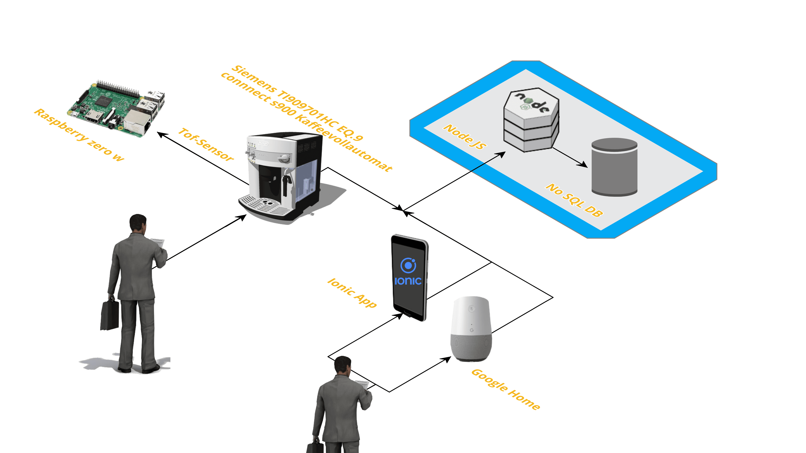

# Office Barista Project Description
The goal of the elective course 'IoT Hackathon: From business concept to implementation' at Reutlingen University was to develop the MVP for an IoT product during a two-day hackathon.
Office Barista is the business idea of the winter semester 2017/18 course ([contributors](#creating-jobs)). Our solution provides an innovative approach to the coffee ordering process in modern offices. The service not only offers automated monthly billing for the coffee consumption of different users and therefore abandons annoying check lists, but also enables the automated reordering of coffee beans and milk. Additionally a connected coffee machine, Google Home and self-developed hardware is used to facilitate coffee ordering directly from the workplace through voice and the Office Barista app.

## MVP
After brainstorming, the team agreed on the following requirements in order to provide a minimal viable product:
For the coffee order, the user has three options:
Either he uses the developed app, his RFID card or orders through Google Home, which has to be centrally located in the office.

* If ordering through Google Home, user identification and billing is done through Googles integrated voice recognition.
* If ordering over the app, the user is identified by logging into his unique user account.
* In the third case, the user can order a coffee with his RFID card directly at the coffee machine, he is then identified by the UID of his card that is associated with his Office Barista user account.

In the first two cases, the user has access to all standard coffee types, the 'Siemens TI909701HC EQ.9 connect s900 coffee machine' provides.

With every coffee order the consumption of milk and coffee beans is tracked. If the stock of an item falls below a defined critical value (defined by an admin), the reordering process is triggered.
Therefore either a shopping list is created on [Wunderlist](http://wunderlist.com), or automated reordering over Amazon is placed.

## Architecture diagram

The 'Siemens TI909701HC EQ.9 connect s900 coffee machine' is connected to a Raspberry Pi.
Ordering a coffee is possible via voice input over Google Home, the use of the Office Barista app, or through a manual order at the device.
A time of flight sensor is placed above the nozzle, that detects weather a mug is placed below the machine and it's filling level. On the Raspberry Pi, Python is used to read the sensor values and send them to the Office Barista cloud application.
The device API is receiving the data from the sensor. The data is stored in a NoSQL data store.

## Components
* [Backend Overview](https://github.com/gauggelb/Officebarista/tree/master/backend
 "Backend Overview")
* [Frontend Overview](https://github.com/gauggelb/Officebarista/tree/master/frontend
 "Frontend Overview")
* [Hardware Overview](https://github.com/gauggelb/Officebarista/tree/master/hardware
 "Hardware Overview")

## Contributors (and Responsibilities):
* Max Kolb (Backend, Support for Hardware and Frontend, Documentation)
* Aline Mbekuem (Frontend, Documentation)
* Bastian Gauggel (Hardware/ Sensor,  Python Script, Documentation)
* Mathias Zimmermann (Hardware/ Sensor, Python Script, Documentation)
* Timm Roth (Support for Hardware/ Sensor and Frontend, general Support, Documentation)
