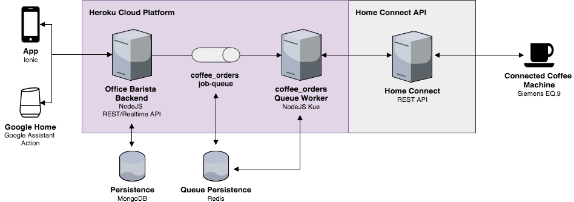
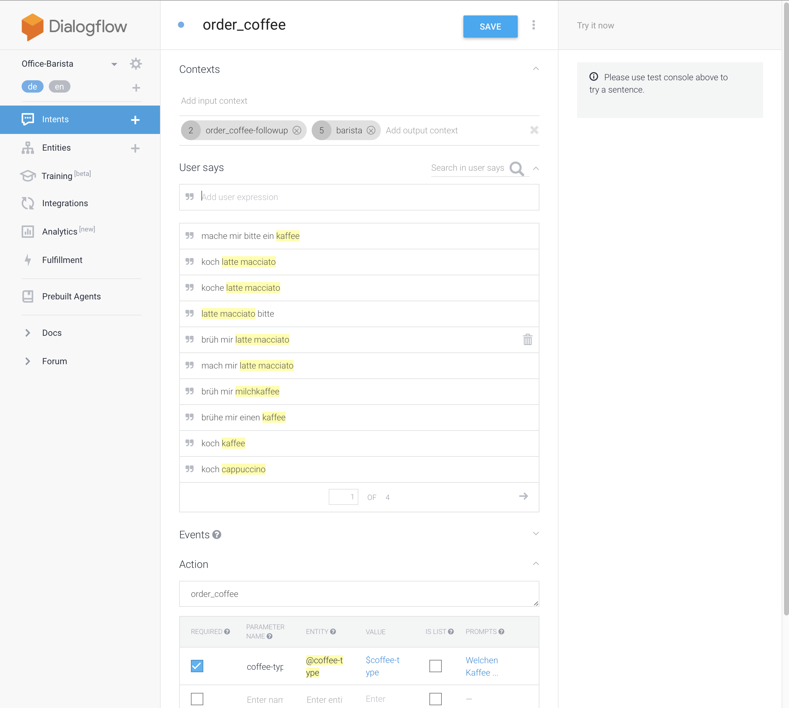

# Office Barista Doku

# Backend
The backend for the Office Barista MVP relies heavily on the NodeJS programming language and its frameworks. The Ionic App and Action for Google Home communicate via sockets and a REST API with the Office Barista backend application. Coffee orders are pushed into a redis-backed job-queue and processed by a NodeJS worker application. Communication with the connected coffee machine is handled with the Home Connect API ([General - Endpoints and Data Encoding | Home Connect Developer Program](https://developer.home-connect.com/?q=docs/api/general/endpoints_dataencoding)).

## System Architecture


### Office Barista Backend - REST/Realtime API
The Office Barista backend is the main backend-component. It combines REST, realtime (sockets) and webhook interfaces for the frontend application, as well as for the Google Action. Furthermore it persists and queries data from the MongoDB database.

The API accepts JSON in request bodies and requires that the `content-type: application/json` header be specified for all such requests. The API will always respond with an object. Depending on context, resources may be returned as single objects, as arrays of objects or paginated arrays of objects.

The API also facilitates cross-origin resource sharing (CORS) so that it can be called from a web application.

#### Authentication
The Office Barista backend uses JSON Web Tokens (JWTs) to authenticate API calls. To receive a JWT, a corresponding user has to be created, through the `POST /users` endpoint. The JWT is then returned in the JSON body of the `POST /authentication` request with the following payload:
```
{
	"strategy": "local",
	"email": "email of the created user",
	"password": "password of the created user"
}
``` 

In any subsequent requests to the API the received JWT has to be transmitted via the HTTP authorization header. The token should be prefixed with “Bearer” followed by a space. For example: `Bearer your-jwt`.

#### REST API 
For the REST & realtime API, FeathersJS ([Feathers | Instant Realtime and REST APIs for Node.js](https://feathersjs.com)) is used. It’s a modern API framework for nodejs, based on express and socket.io, the popular node extensions. 

The API documentation can be found here: [OfficeBarista Cloud](https://documenter.getpostman.com/view/2285590/officebarista-cloud/7EDAu5x#358b890a-d489-880f-fc1e-b6efad49cf21)

### Queue Worker
The queue is build with the lightweight job-queue framework KueJS ([GitHub - Automattic/kue: Kue is a priority job queue backed by redis, built for node.js.](https://github.com/Automattic/kue)) and a redis datastore. Jobs are processed based on the FIFO (first in first out) principle. The queue is necessary because of the fact that the coffeemaker can only process one coffee at a time. Therefore the queue enables the office barista application to receive multiple parallel coffee orders and process them one after another.

### Home Connect API
The API for accessing physical appliances is currently in beta and a special developer account is needed in order to use the corresponding features.

Furthermore home connect uses an OAuth2 Authorization flow to grant access to appliances. 

Read more about the Home Connect features here: [General - Endpoints and Data Encoding | Home Connect Developer Program](https://developer.home-connect.com/?q=docs/api/general/endpoints_dataencoding)

### Persistence - MongoDB
The backend stores all relevant data in a cloud hosted, distributed MongoDB Cluster with 3 nodes. The Database has collections for each API feature, including `users, orders, favproducts, materials & sensordata`.

All data is stored unstructured and in documents. The queried data is returned in JSON.

### Deployment
The office barista backend, as well as the queue worker are deployed on the heroku cloud platform (https://heroku.com), on free so called „dynos“. Deployments can be triggered via the heroku cli.

The MongoDB cluster runs on the free plan of MongoDB Atlas ([Fully Managed MongoDB, hosted on AWS, Azure, and GCP | MongoDB](https://www.mongodb.com/cloud/atlas)), the dedicated cloud hosting provider for MongoDB.

The redis datastore is also deployed in the cloud. We used the free plan of redislabs (https://redislabs.com/), to deploy the needed resources.

# Google Home
Google Home is used to enable customers to order coffee by using their voice. We decided to use Google Home over the other available voice assistant platforms because of the unique possibility to identify different users based on their unique voice characteristics. In order to extend the Google Assistant with custom Office Barista commands a Google Action was developed.

## Google Action
Google Actions are similar to Amazon Alexas Skills. Google provides a suite of tools for developers to build custom voice based experiences. 

### Action Console
Every Google Action needs to be registered in the „Action Console“. There you define the name and hot-word, the Assistant listens for to trigger your Action (e.g. Office Barista). Furthermore you can enable testing from the console in the provided online simulator or even on real devices, connected to the logged in Google Account. 

### Dialogflow
Dialogflow is a powerful tool to build conversational interfaces. You define intents and entities, that are compared against the sentences you input into the system. If an intent is matched to an input the given functionality is executed. This can either be a static phrase or sentence, that is presented to the user as response, or dynamic data, that is fetched from a webhook call. The Office Barista application mostly relied on dynamic data, therefore the fulfillment of questions to the service was mostly implemented with webhook calls to the office barista backend.



#### Fulfillment via Webhook
To fulfill these webhook calls we used the `actions-on-google` framework for nodejs provided by Google. 

When the order_coffee intend is matched by Dialogflow the specified webhook endpoint in the office barista backend gets called. In the first step the unique userId is extracted from the provided data and is matched against the `voiceId` parameter of the `users` database collection. 
If the userId is matched with a registered user the  newest value of the distance sensor (to identify if a coffeemuig is placed under the machine) is read from the `sensordata` collection.  If the value is in range (between 130 and 150) a new order is appended to the job queue and the coffee will eventually be processed and invoiced to the user who ordered the coffee. 
When the provided Google userId is not matched with any registered user in the database, the system assumes, that the users voice is not yet recognized. Therefore a voice command is returned, asking the user for his name. The `users` collection is queried again with the provided first- and last name (or first name only). If the user is neither found by voiceId nor by user name, the user needs to be registered by an administrator or register himself in the office barista app. When a user is identified in the database with the provided name, a random four character identification code gets send to the email of the identified user. This functionality is implemented in order to prevent fraud. The user then gets the prompt to read out the code he received by email, if the code is correct, the coffee order gets processed and invoiced.

# Wunderlist
Wunderlist was used to simulate an automated shopping list. If the system detects that coffee beans or milk are going to be empty soon a new task on the Office Barista shopping list in the Wunderlist app is created. On completion of this task, the corresponding amount of material is automatically added to the specific material in the `materials` collection.

## Wunderlist API
Similar to the Home Connect API, Wunderlist also implements an OAuth2 authorization flow. You need to register as a developer and create an application. When Authorizing with the clientId of the registered application you receive an access token, that has to be sent with any subsequent request.

Wunderlist also provides webhook events, that notify your application of changes of the user. The webhook feature is used to update the materials in stock, as described above.

Read more about the Wunderlist API here: [Documentation | Wunderlist Developer](https://developer.wunderlist.com/documentation) 