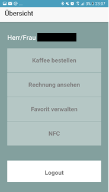
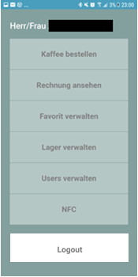
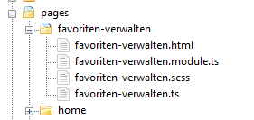
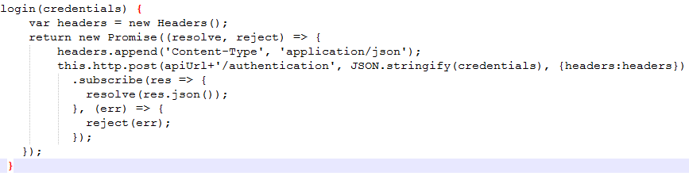

# Office Barista Frontend (App)
The Graphical User Interface (GUI) of this project was made with ionic, an open source web framework for creating hybrid apps and progressive web apps based on HTML5, CSS, Sass and JavaScript / TypeScript. It is based on AngularJS and Apache Cordova.

## Frontend
The GUI is the intermediate between the user and the backend.  It allows specific users to access or/and modify specific data. In our case, users are classified into two categories: normal user and admin. Depending on user role, there are different possibilities:

### Every user can:
-	login                               
-	logout
-	order coffee
-	see the bill of all ordered coffee
-	save favorit
-	read NFC tags

### Admin can:
- do the same as every user
-	register a new user
-	add and modify materials
-	add and modify users (including blocking users)

## Normal user’s view                                  

                
                                                                                                            
## Admin’s view  

                                  

## App-Views
Every app-view is a page including three types of files:  html, typescript and css.

The Html document contains the elements (fields, labels, …) and values which will be outputted.
The Typescript document can implement page’s functions, send variables to the html and call provider’s functions.
The css document is responsible for the style which will be applied to the html.

     

## Providers
Providers are services, which use http calls within functions in order to transport data from the pages to the backend and from the backend to the pages.

You can find all the pages of this project [here](https://github.com/gauggelb/Officebarista/tree/master/frontend/src/pages).

         
