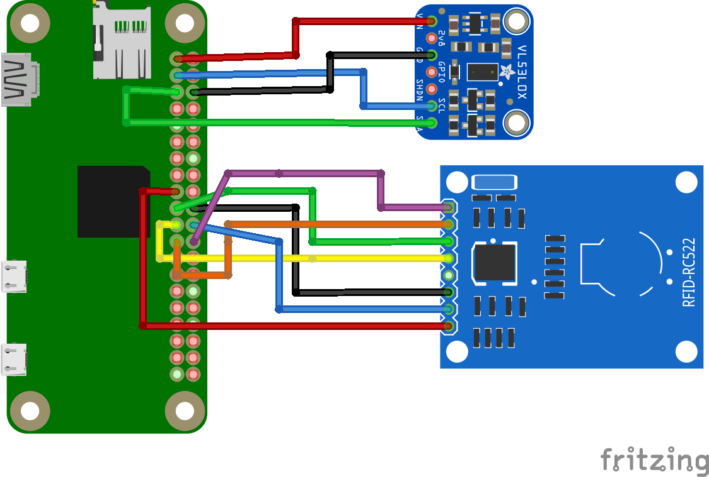
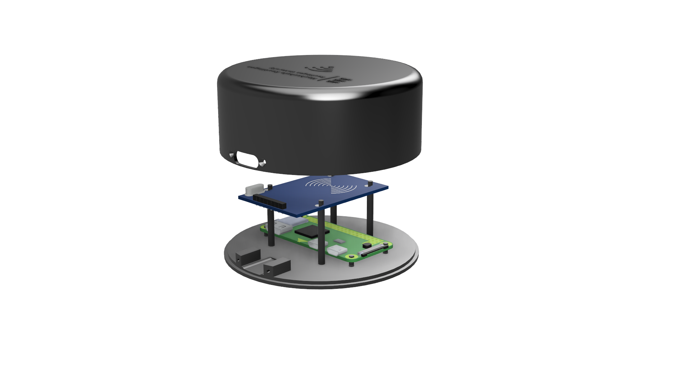
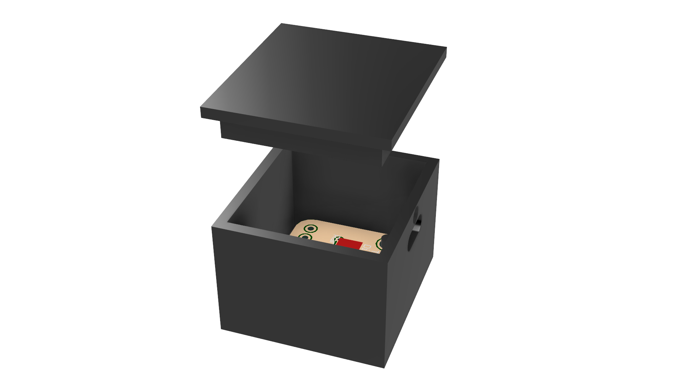

# Officebarista
The Hardware for this project is based on a Raspberry Pi Zero W with a MFRC522 RFID-Reader and the VL53L0X Time of Flight sensor. The scripts are realized in python and the Case is designed in Fusion 360.

## Layout from the Hardware settings


The Time of Flight Sensor is used to measure the distance and to find out if a cup is under the coffee machine and if it is full.
If a user wants to order a coffee directly at the coffee machine and can not order via Google Home or the app, then he have to hold his RFID card to the reader in order to let a coffee out of the coffee machine.

## Basestation
The basestation is working with a Raspberry Pi zero W mounted on Raspbian.

### Used Components:

 - Raspberry PI Zero W
 - Jumper Wire
 - SD-Card with 8GB Space
 - MFRC522-RFID Sensor
 - Vl53l0X Time of Flight Sensor
 - 3x Screw M1x6

### Installation Raspberry PI

1. Download Raspbian ([Raspbian download](https://www.raspberrypi.org/downloads/ "Download Raspbian"))
2.  Flash the Raspbian to SD-Card (Note: bevor removing the SD-Card please make Step 3)
3. Connecting the Raspberry PI to Wifi ([Raspberry PI Wifi Setup](https://core-electronics.com.au/tutorials/raspberry-pi-zerow-headless-wifi-setup.html "Raspberry PI Wifi Setup"))
4. Update & Upgrade the Raspbian
```
sudo apt-get update && sudo apt-get dist-upgrade -y
```
5. [Installing Vl53l0X API](https://github.com/cassou/VL53L0X_rasp "Installing VL53l0X")
6. [Installing MFRC-522-RFID Reader](https://tutorials-raspberrypi.de/raspberry-pi-rfid-rc522-tueroeffner-nfc "Installing MFRC-522-RFID Reader")
7. Copying the Scripts to the Home Folder
8. Install npm and  nodejs
```
sudo apt-get install nodejs npm
```
9.  install PM2 to Autostart the Script after rebooting
```
npm install pm2@latest -g

```
10. Description how to use PM2 can find [here](http://pm2.keymetrics.io/docs/usage/quick-start/#application-declaration "Installing PM2")


### Case Basestation


## Time of Flight sensor (VL53l0X)
The Time of FLight Sensor is a laser-based sensor that reliably measures distances between 20mm and 2000mm.
The ToF is positioned below the display so as to detect the bottom of a cup that is below the spout.

### Case VL53L0X Time of Flight sensor



## 3D Modelling
To model the Cases we used Fusion 360. The Cases can be printed with every 3D-Printer by using the 3D Models:

### Cases included:
 - ToF Case
 - BaseStation Case
